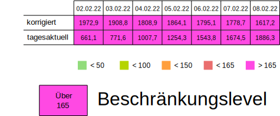
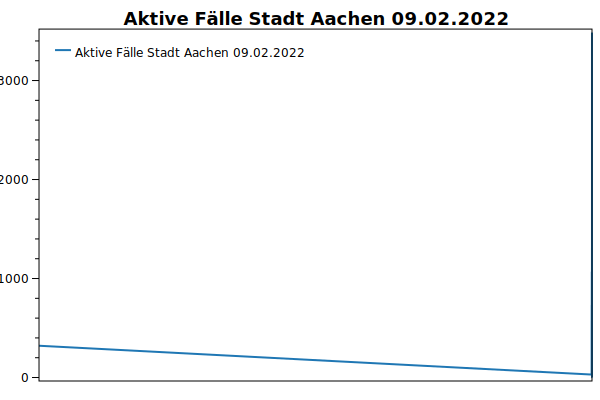

# Corona Daten für Aachen

Die Daten sind aus den [aktuellen Pressemitteilungen](https://www.staedteregion-aachen.de/de/navigation/aemter/oeffentlichkeitsarbeit-s-13/aktuelles/pressemitteilungen/aktuelle-pressemitteilungen/coronavirus/)
sowie dem [Meldungsarchiv](https://www.staedteregion-aachen.de/de/navigation/aemter/oeffentlichkeitsarbeit-s-13/aktuelles/corona-meldungsarchiv/) geparsed.

## 7-Tage-Inzidenzen

| Städteregion Aachen | Stadt Aachen |
| --------------------|--------------|
|  |  |

Zur Berechnung der Inzidenz werden die Einwohnerzahlen von [IT-NRW](https://www.it.nrw/statistik/eckdaten/bevoelkerung-nach-gemeinden-93051) aus dem Jahr 2019 genutzt.

## RKI-Inzidenzdaten

Im folgenden die vom RKI herausgegebenen Daten der letzten Tage und die daraus resultierende Beschränkungsstufe.
Als Grundlage für Beschränkungen werden die tagesaktuellen ("eingefrorenen") Zahlen verwendet, auch wenn sie nachträglich korrigiert werden.

Die Inzidenzwerte werden aus denen vom [RKI veröffentlichten Daten](https://www.rki.de/DE/Content/InfAZ/N/Neuartiges_Coronavirus/Daten/Inzidenzen.html) extrahiert.

## Diagramme

