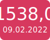

# Corona Daten für Aachen

Die Daten sind aus den [aktuellen Pressemitteilungen](https://www.staedteregion-aachen.de/de/navigation/aemter/oeffentlichkeitsarbeit-s-13/aktuelles/pressemitteilungen/aktuelle-pressemitteilungen/coronavirus/)
sowie dem [Meldungsarchiv](https://www.staedteregion-aachen.de/de/navigation/aemter/oeffentlichkeitsarbeit-s-13/aktuelles/corona-meldungsarchiv/) geparsed.

## 7-Tage-Inzidenz Stadt Aachen


## Verspätet gemeldete Fälle
Fälle, die mehr als 7 Tage zu spät gemeldet werden tauchen in der RKI-Statistik nicht auf. Die in den Diagrammen abgebildeten Zahlen berücksichtigen diese Fälle trotzdem.
Im folgenden sieht man 

```
"Anzahl gemeldete Fälle Heute(Infektion älter als 7 Tage)" /
"Anzahl gemeldete Fällte Heute" (Anteil der alten Fälle in Prozent).
```

Die RKI-Daten stammen vom [COVID-19 Datenhub](https://npgeo-corona-npgeo-de.hub.arcgis.com/datasets/dd4580c810204019a7b8eb3e0b329dd6_0)


## Diagramme


